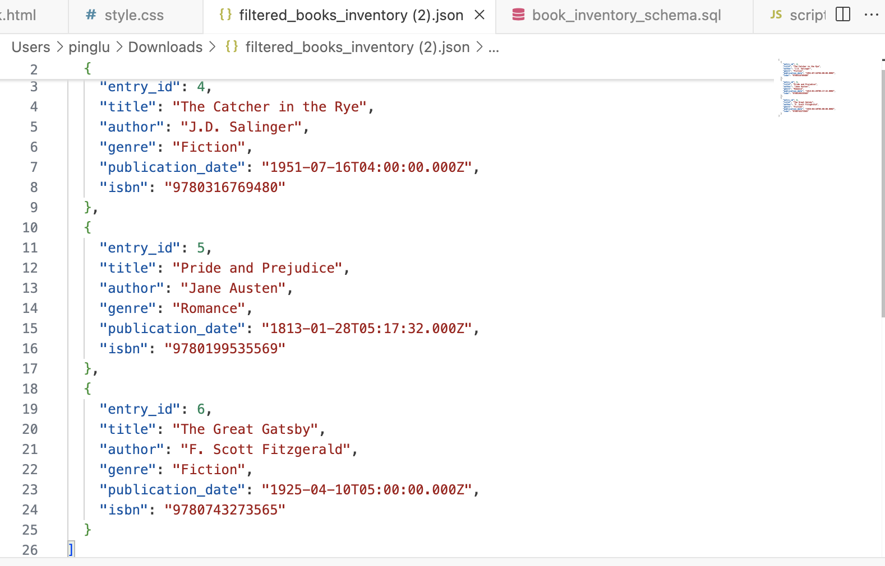

# Book Inventory System

## Introduction

The Book Inventory System is a web application that enables users to manage a book inventory by adding new books, filtering existing entries based on multiple criteria, and exporting data in CSV or JSON formats. This documentation covers how to set up, use, and maintain the system, along with design decisions and challenges encountered during development.

<p align="center">
	
</p>

## Table of Contents
- [Setup and Installation](#setup-and-installation)
- [How to Use the System](#how-to-use-the-system)
- [Design Decisions](#design-decisions)
- [Challenges and Solutions](#challenges-and-solutions)
- [Future Improvements](#future-improvements)

## Setup and Installation

### Prerequisites
- Node.js and npm installed
- PostgreSQL installed
- Clone the repository to your local machine.

### Steps

1. **Clone the Repository**
   ```bash
   git clone https://github.com/pingluuu/Book_Inventory_System.git
   cd Book_Inventory_System
2. **Install Dependencies**
   ```bash
   npm install
3. **Database Setup**
### Create the Database

1. Open your PostgreSQL client (e.g., **pgAdmin** or **psql**).
2. Create a new database. You can name it `book_inventory` or choose another name.
3. Run the provided SQL script `schema.sql` to set up the database schema:

   ```SQL
   -- Create ENUM type for genres
    CREATE TYPE genre_enum AS ENUM (
        'Fiction', 'Non-Fiction', 'Mystery', 'Science Fiction', 'Fantasy',
        'Romance', 'Biography', 'History', 'Children', 'Self-Help', 'Other'
    );

    -- Create the Inventory table
    CREATE TABLE Inventory (
        Entry_id SERIAL PRIMARY KEY,
        Title VARCHAR(255) NOT NULL,
        Author VARCHAR(255) NOT NULL,
        genre genre_enum NOT NULL,
        Publication_date DATE NOT NULL,
        ISBN VARCHAR(13) NOT NULL UNIQUE CHECK (ISBN ~ '^[0-9]{13}$')
    );

4. **Configure Environment Variables**
   Create a .env file in the project root to store your database connection details:
   ```Makefile
   DB_USER=your_postgres_username
   DB_HOST=localhost(or the host number)
   DB_DATABASE=book_inventory(or the database name you choose)
   DB_PASSWORD=your_postgres_password
   DB_PORT=your_port_number

5. **Starting the Server**
   ```bash
   npm start
  Access the application by navigating to http://localhost:3000 in your web browser.
## How to Use the System
### Adding a Book

1. Navigate to the **Add Book** page.
2. Fill in all required fields (Title, Author, Genre, Publication Date, and ISBN).
3. Click **Add Book** to save the book to the inventory.

   <p align="center">
	
</p>

### Filtering Books

1. Go to the **Filter Books** page.
2. Enter any desired criteria (e.g., Genre, Author, Publication Date) and click **Filter**.
3. Filtered results are displayed in a table format below the form.

<div style="display: flex; justify-content: space-between;">
  
  
</div>


### Exporting Data

1. On the **Filter Books** page, you can export filtered results.
2. Use the **Export as CSV** or **Export as JSON** buttons to download the data in your preferred format.

<div style="display: flex; justify-content: space-between;">
  
  
</div>

## Design Decisions
### Database Schema
- An ENUM type (genre_enum) is used to enforce genre consistency by restricting entries to predefined genres.
- The ISBN field is restricted to a unique 13-digit format for data accuracy and reliability.
### Frontend Interface
- Form Validation: Client-side JavaScript validation ensures that required fields are filled and that ISBN values are in the correct format.
- Responsive Design: CSS styling provides a user-friendly experience across various screen sizes.
### Export Feature
- CSV and JSON formats are supported for exporting data, making it easy to integrate the exported data with other tools or platforms.
  
## Challenges and Solutions
### Database Constraints
- Challenge 1: Enforcing a unique 13-digit ISBN constraint for valid ISBN number. There will be an option for 10 digits ISBN for future improvement, not implemented here due to time constraint.
  - Solution: A CHECK constraint ensures ISBN is a 13-digit number, while a UNIQUE constraint prevents duplicate entries.
- Challenge 2: Users might input different genres with minor differences, causing difficulty to classify.
  - Solution: Implement a menu for genres for users to choose from. If the genre is not listed, there is a "Other" option.
- Challenge 3: The book information might not be completed, causing difficulty in identifying the book later.
  - Solution: Make all parameters mandatory, otherwise an alter window will pop up. Users have to enter the complete book information to add the book.
### UI Responsiveness
- Challenge 1: Making the theme consistent.
  - Solution: Making the colour and layout align with the theme of cherry blossom and book, improving visual consistency.
- Challenge 2: Making a View book page will cause unnecessary UI, making the navigation repetitive.
  - Solution: Combine the view-all-book function with the filter-book function, where users filter nothing and will return a full list of books. 
### Validation of Input Fields
- Challenge: Preventing invalid data from being submitted.
  - Solution: Implemented both frontend and backend validation, with error messages to guide the user in case of invalid input.

## Future Improvements
- Pagination for Filtered Results: To handle large datasets efficiently, pagination could be added to the filtered results table.
- Enhanced Search: Implementing full-text search or additional filters could improve the search capabilities.
- ISBN Validation Improvement: Adding logic to handle ISBN-10 or ISBN-13 validation for more flexible book entries.
- Published Book Validation: Validate a book exists by checking its information with a larger library database, will need to call relative API to fulfill this challenge.
  
## Contributor
All By Ping Lu ([GitHub](https://github.com/pingluuu))
